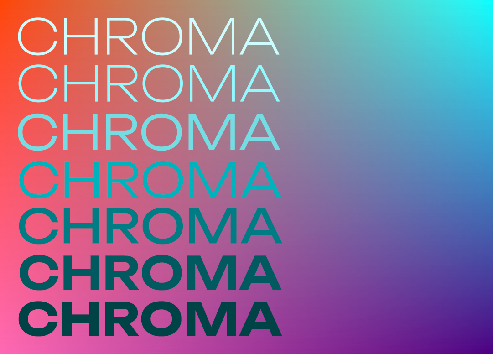
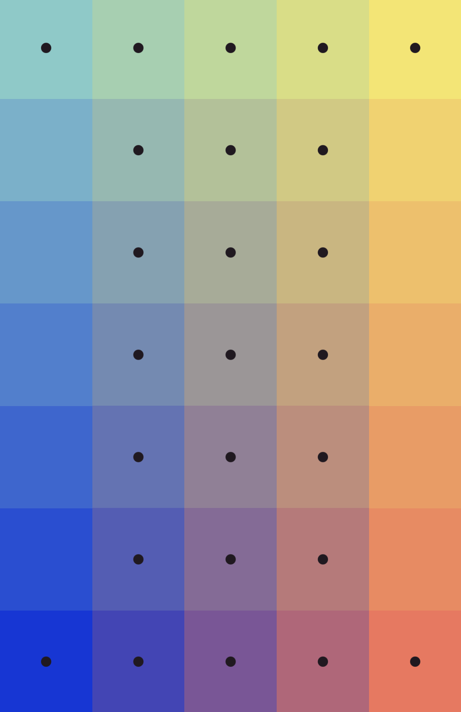
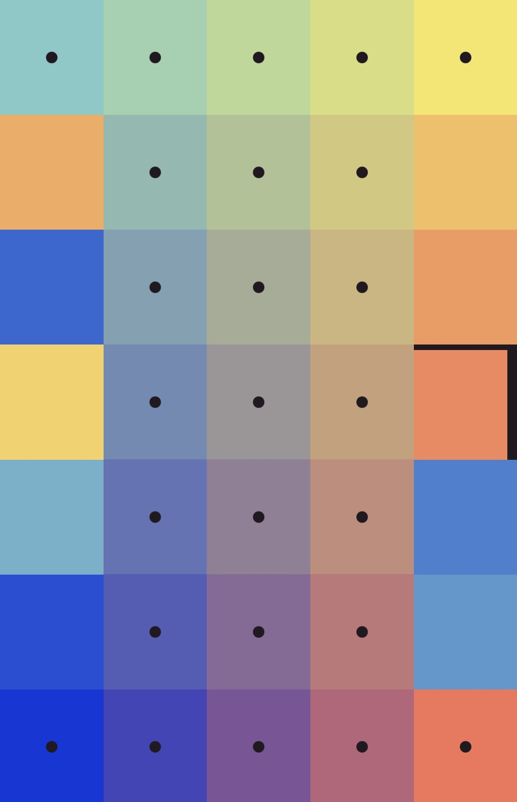

# I Love Hue | CHROMA

For my first project I plan to create an emulation of the iOS app called **I Love Hue**, a color-based puzzle game.

## Puzzle preview + after scramble

## 

## User Stories

A User will be able to...
- Generate a unique puzzle with randomly generated colored squares using CSS Canvas
- Observe the scrambling of the puzzle
- Observe the black dot "anchors" indicating which squares are not to be shuffled
- Click and drag a piece to be swapped with another square
- Play until the puzzle has been solved
- When the game is over, be alerted with how many moves they made 
- When the game is over, give the option to restart the game and play again with a new challenge
- Listen to meditative music while playing the game (as per the original)

## Wireframe
### Opening 
Animated text announcing game.

## Entities

This project will not use a database. However it will need to be constructed with
- CSS Canvas
- A JS Class for building the puzzle
- A JS Class for selected square item
- Function for checking the solution

## Notes
- https://codepen.io/caitlinreid1/pen/ExpjeRY