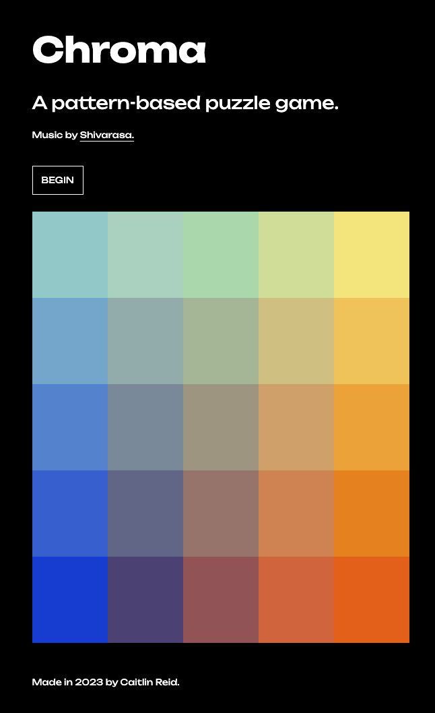
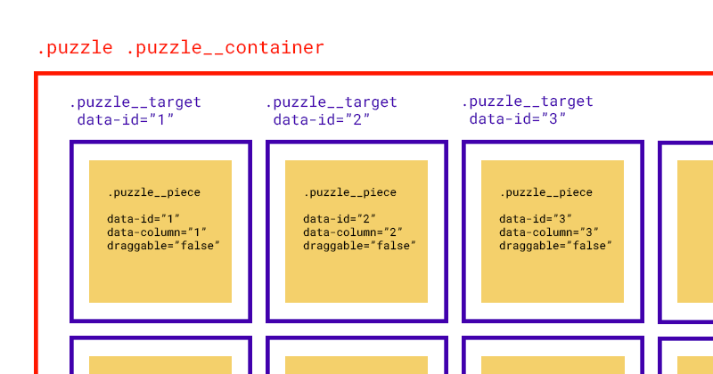
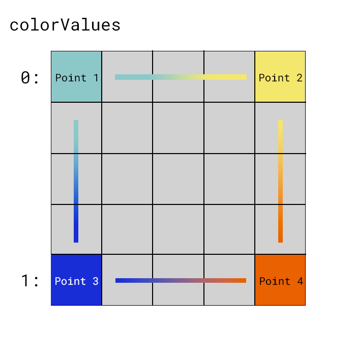
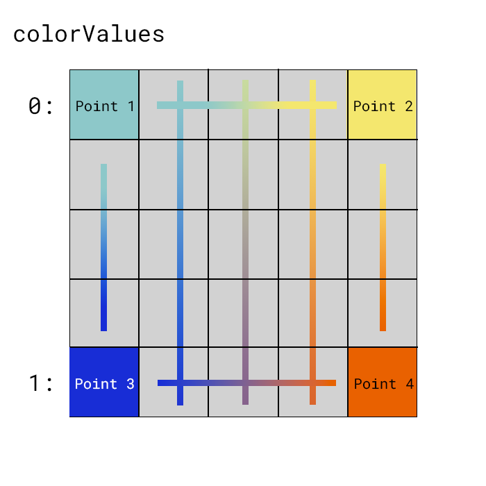

<br><br><br>


# CHROMA 

Table of Contents
* <a href="#Goals">Goals</a>
* <a href="#Technologies">Technologies</a>
* <a href="#Approach">Approach</a>
* <a href="#Commands">Commands</a>
* <a href="#Roadmap">Roadmap</a>

## Goals

Chroma is a pattern-based puzzle game inspired by the iOS app, I Love Hue. My goal was to create an aesthetically pleasing web experience with a javascript-generated 4-pointed gradient, adding a meditative atmosphere to relax and entertain the user. In its current form, it is designed for desktop.

### User Stories

A User will be able to...
- Generate a unique puzzle 
- Initiate the puzzle's scramble with black dot "anchors" indicating which piece are permanently fixed on the board
- Click and drag a piece to be swapped with another square
- Play until the puzzle has been solved
- When the game is over, give the option to restart the game and play again
- Listen to meditative music while playing the game to give an introspective atmosphere

### Technologies

This web application was built with: 

* HTML5
* [Drag and Drop API](https://developer.mozilla.org/en-US/docs/Web/API/HTML_Drag_and_Drop_API)
* SCSS
* Vanilla Javscript


## Approach

In this README I will describe the puzzle's functionality as expressed in HTML, Javascript and SCSS. Specifically I will discuss the creation of the puzzle board, its drag and drop functionality, as well as the the dynamically generated 4-pointed color gradient. 

### HTML + BEM 

The first part of the project I created was the game board. 
I made a point to specifically use BEM Conventions when creating this complicated but essential architecture. It's what has drove the organization of subsequent styling and javascript files. 

To begin, I used CSS Grid to arrange 25 divs inside a single container. The Drag and Drop API is designed such that for every **draggable element** there is a designated **drop target**. So inside every square element, I added another div to serve as the actual puzzle "piece" that was swapped between locations.


<br><br>

**Diagram 1** This illustrates the basic structure of my HTML. Any yellow `.puzzle__piece` can be dragged and dropped into any blue `puzzle__target` containing div.

Here's the diagram translated to a bit of sample code:

```html
<div class="puzzle puzzle__container">
    <div class="puzzle__target" data-id="1">
        <div class="puzzle__piece" data-column="1" data-id="1" draggable="false"></div>
    </div>
    ...
</div>
``` 
<br>

 

After creating all of the necessary elements, I gave each `puzzle__piece` a `data-id`, starting with 1 and incrementing upwards. 
Giving each piece and target a unique ID is important to distinguish between them.  When we check for the accuracy of the game, we look to see if the interior puzzle piece's ID matches the target after being moved around by the user. 
To make targeting elements easier in `color.js`, I also gave each piece a `data-column`. This will be discussed further in the section on Color.

A final note on the HTML: I began this project with hardcoded HTML elements, but if I were to refactor this project, I would consider dynamically generating each element with javascript's `createElement` method to easily update the number of pieces and orientation as needed, rather than updating the DOM with what already exists. However this is certainly a good starting point before developing something more dynamic in future versions.


## Javascript

### Board.js | setupBoard()

After laying out all of the 25 `puzzle__pieces` and their surrounding `puzzle__target`, the next step I took was to create the most important functionality of the game, drag and drop. Leveraging HTML's drag and drop capability, I targeted pieces on the board and configured event listeners to update the DOM accordingly when pieces were moved.

You may be familiar with javascript's `addEventListener` method; the Drag and Drop API attaches listeners to DOM elemennts but instead of listening on "click" or "window", it listesn on dragevents. In our case Chroma listens on the puzzle piece itself for `dragstart`, the beginning of the drag event, `dragend`, marking the end of the drag.

For every `puzzle__piece` to which this drag event listen has been attached, the data `draggable` has been set to true.

```javascript
const dragstart = (event) => {
      
      // set dragged element to a variable
      dragged = event.target;
  
      // Add this element's id to the drag payload so the drop handler will know which element to add to its tree
      event.dataTransfer.setData("text", event.target.id);
      event.dataTransfer.effectAllowed = "move";
  
      // shadow on puzzle piece
      event.target.classList.add("dragging");
    }

    pieces.forEach((piece) => {

      piece.addEventListener("dragstart", dragstart);
      piece.addEventListener("dragend", (event) => { event.target.classList.remove("dragging") })
    
    })
```

As you can see, in the dragstart function I begin by setting the puzzle piece that's being grasped and set it to the variable `dragged`. 

The `DataTransfer` object is used to hold the data that is being dragged during a drag and drop operation. It may hold one or more data items, each of one or more data types. In our case, we're setting the dataTransfer object to accept "text" and we're setting the `effectAllowed` to "move". Additionally I added a class to the `puzzle__piece` called `dragging` to add styling to the piece activated. 

```javascript
const dropEvent = (event) => {

    // prevent default action (open as link for some elements)
    event.preventDefault();

    let newPlace = event.target.parentElement

    // move dragged element to the selected drop target
    if (newPlace.classList.contains("puzzle__target")) {
    
    // find the dragged element's parent and append the square it's hover above
    dragged.parentElement.appendChild(event.target)

    // append dragged element to the new drop target
    newPlace.appendChild(dragged);

    }
    
    checkGame()

}

targets.forEach((droptarget) =>{

    droptarget.addEventListener("dragover", (event)=> { event.preventDefault() }, false);
    droptarget.addEventListener("drop", dropEvent)
    
})
```

Additionally, there are two listeners on the droptarget itself. In Chroma there are two listeners, one for the `dragover` event, and the final the `drop` event.

`eventPreventDefault()` is used to prevent the default behavior, which without `draggable` set to true, and without event listeners, would prevent elements from being moved across the page. So we override that behavior. 


So when you're dragging a puzzle__piece, your droptarget hovers over another puzzle piece. So I set a variable `newPlace` to be the `event.target.parentElement` -- which is to say `puzzle__target`.

Next I check if the newPlace has the class "puzzle__target", and if so, I append the event.target to the initial `dragged` parent.

And then I append `dragged` to the `newPlace`. 

This is to say that the dragged element and the event.target switch places by being appended to each other's parents, each other's `puzzle__targets`.

Finally, if the `dropEvent` clears, then we call `checkGame()` to see if the drop successfully solved the puzzle. So for every puzzle move, we check to see if it is complete.

### Board.js | checkGame()

As I mentioned, the `checkGame` function is what ascertains whether the puzzle has been solved by checking whether the ID of the `puzzle__piece` matches its container `puzzle__target`

```javascript
const checkGame = () => {

  let count = 0;

  pieces.forEach((piece) => {

    // if piece's id matches its parent's id
    if (piece.dataset.id === piece.parentElement.dataset.id) {
      
      count++

      if (count === 25) {

        star.classList.remove('star--hide')
        
        winner.innerHTML = "YOU WON! CONGRATS."

        play.innerHTML = "BEGIN AGAIN"
        
        resetGame()

      }

    }

  })

}
```

First I instantiate a variable called `count`. I loop over all of the `pieces` and I check if the piece's ID matches its parents' ID. If it does match, it increments the count, and if the count equals 25, it means that all pieces have returned back to their homes. In turn we remove the class `star--hide` which makes the celebratory star animation visible, lets the user know they won, makes the play button visible again, and resets the game to be played again.


### Board.js | startGame()

Once the user clicks the BEGIN button, a number of classes are added and subtracted to display buttons on the page. Additionally it initates the audio to begin playing.

```javascript
    reset.classList.remove('button--hide')
    play.classList.add('button--hide')
    star.classList.add('star--hide')
    audio.play()
```

The overarching design to it make the outside squares not movable and mix up the inside 9 squares and make them draggable to create the puzzle. 

To create the black dots on the outside of the puzzle, I loop over `pieces` and set the innerHTML to an svg of a black dot

```javascript
pieces.forEach((piece, index) => {

    // Add Black dots to all outside points
    if (index < 5 || index > 19 && index < 25 || piece.dataset.column == 1 || piece.dataset.column == 5 ) {

      piece.innerHTML = 
      `<svg class="black-dot" viewBox="0 0 100 100" xmlns="http://www.w3.org/2000/svg">
          <circle cx="50" cy="50" r="5" />
      </svg>`

    }
...
```

To create the inner mixed up sequence of puzzle piece, I instantiated a new array called `newArr` and I set the rest of the squares' IDs to be added to this array.

```javascript
  let newArr = [];


  pieces.forEach((piece, index) => {
    
    ...

    else {

      piece.draggable = true

      piece.classList.add('draggable')

      newArr.push(piece.dataset.id)
      
    }
    ...
}
```

We need this new array of the inner squares to know which to scramble. I used the Fisher-Yates shuffle to mix up the order of the IDs in the array. I call that function and pass my array `shuffle(newArr)`.

Now that my `newArr`'s ids have been mixed up, I need to create a list of dropzones that match the shuffled order of the new Array. 

```javascript
  let shuffleList = []

  for (i = 0; i < newArr.length; i++ ){

    targets.forEach(target => {

      if (target.dataset.id === newArr[i]) {

        shuffleList.push(target)

      }

    })

  }

```
By the end of this function, I have a node List of shuffled inner elements.

Next, I go ahead and loop over the shuffle list as well as the inner pieces, and when the order of the shuffle list matches the order of the inner piece, the square is appended to the new list. 

```javascript
  for (let i = 0; i < shuffleList.length; i ++) {

    for (let i = 0; i < innerPieces.length; i++) {

      shuffleList[i].appendChild(innerPieces[i])

    }
  }
```

Finally at the end of startGame() we call `setupBoard()` to initiate the drag and drop elements of the game.

### Board.js | resetGame()

To reset the game, I remove all the black dots from the board by looping over pieces and setting the innerHTML to an empty string like so:

```javascript
  pieces.forEach((piece, index) => {
  
    // remove all black dots from outside pieces
    if (index < 5 || index > 19 && index < 25 || piece.dataset.column == 1 || piece.dataset.column == 5 ) {
    
      piece.innerHTML = "" 
    
    }
```

Additionally I add and remove classes to be able to show or hide the buttons as needed.

```javascript
    piece.classList.remove('draggable') 
    piece.draggable = false
    reset.classList.add('button--hide')
    play.classList.remove('button--hide')
```

Finally I wrote a funtion to put elements back in proper order if stopping mid-game to reset everything. 

I did so by targetting all the piece with a class of `.draggable`. Looping over the innerPieces and targets, I wrote an if statement to check if the ID of the innerPiece matched the target's ID, and if so, appended that innerPiece to it's original target.

```javascript
const innerPieces = document.querySelectorAll('.draggable');

    for (let i = 0; i < innerPieces.length; i++) {
  
      for (let j = 0; j < targets.length; j++) {
  
      
        if (innerPieces[i].dataset.id === targets[j].dataset.id ) {
    
          targets[j].appendChild(innerPieces[i])
    
        }

      }

    }
```

Finally I concluded board.js by adding an event listener to the play button to `startGame` as well as another event listener to `reset` to `resetGame`.

### Color.js | Dynamically generated color values

#### Creating the 4-pointed color gradient.

My plan was to dynamically generate color values on the board instead of hardcoding them in SCSS. This is because I wanted to leave open the possibility for changing the pattern with each subsequent game round, creating new challenges and color combinations. 

First thing I did was define each of the four points

```javascript
let pointOne = [143, 201, 200] // Light Blue
let pointTwo = [243, 229, 118] // Yellow
let pointThree = [23, 54, 211] // Dark Blue
let pointFour = [230, 97, 125] // Red-Orange
```

These are the RGB values of each corner I wanted to create on the board. I've commented in the color each one corresponds to for reference.

Next I decided to create an object that stored the values of each generated color:

```javascript
let colorValues = {
   0: [pointOne, [], [], [], pointTwo],
   1: [pointThree, [], [], [], pointFour]
}
```

The easiest part was calculating the outside square color values, because I already knew the initial four points.



I created this data structure to keep track of the values that were generated by the gradient, that could then be used to find the intermediary values of the interior vertical gradients

### Point One to Point Two 

```javascript
let pieces = document.querySelectorAll('.puzzle__piece');


pieces.forEach((piece, index) => {

   // pointOne to pointTwo
   if (index < 5 ) {

       percent = index / 4
  
       let varR = colorValues[0][0][0] + percent * (colorValues[0][4][0] - colorValues[0][0][0]);
       let varG = colorValues[0][0][1] + percent * (colorValues[0][4][1] - colorValues[0][0][1]);
       let varB = colorValues[0][0][2] + percent * (colorValues[0][4][2] - colorValues[0][0][2]);

       const generateColor =  `rgb( ${varR}, ${varG}, ${varB} )`
  
       colorValues[0][index][0] = varR
       colorValues[0][index][1] = varG
       colorValues[0][index][2] = varB

       piece.style.backgroundColor = generateColor
   }

...

}
```

Looping over all of the pieces, I used the index to determine the position of the first, top row of the puzzle. 

I created four values `varR`, `varG` and `varB` -- and then I set up my calculations to get the new value of the color at that percentage point of the gradient.

I made sure to add the calculated values into my `colorValues` object

```javascript
colorValues[0][index][0] = varR
colorValues[0][index][1] = varG
colorValues[0][index][2] = varB
```

then I took the generated value and added it to the piece at the particular index of my row.

```javascript
const generateColor =  `rgb( ${varR}, ${varG}, ${varB} )`

piece.style.backgroundColor = generateColor
```

The same basic pattern was followed for getting the bottom row of the inital gradient.


### Point 1 to Point 3 (column 1)

To target each column, I made use of a data value I set on the pieces in the HTML. So to get the pieces from Point 1 to Point 3, I targeted everything designated as column 1.

`const col1 = document.querySelectorAll('[data-column="1"]')`

Then I looped over every piece, calculated every new color based on the values in my colorValues object, and assigned it to the pieces




### Columns 2, 3, 4

Once I added the values to my colorValues objects, I had the start and end points of the inner gradients. This was enough information to calculate the gradient colors. As you can see from the diagram, the newly added colorValues were used to calculate the gradients of the inner columns.

```javascript
col2.forEach((piece, index) => {

    percent = index / 4

    let varR = colorValues[0][1][0] + percent * (colorValues[1][1][0] - colorValues[0][1][0]);
    let varG = colorValues[0][1][1] + percent * (colorValues[1][1][1] - colorValues[0][1][1]);
    let varB = colorValues[0][1][2] + percent * (colorValues[1][1][2] - colorValues[0][1][2]);


    varB = (varB + colorValues[0][0][2]) / 2


    const generateColor =  `rgb( ${varR}, ${varG}, ${varB} )`

    piece.style.backgroundColor = generateColor

})
```
Similar to the calculations for the top and bottom rows, I calculated the variable R, G and B values for each colored square, except instead of using the pre-definted `pointOne`, etc, I used the dynamically generated values stored in my `colorValues` object. In the code above, it's calculating between the second value in the top row and the second value in the bottom row. And then just like the top and bottom rows, I'm dynamically adding that generated color to the div.

## Roadmap

After the successful launch of Version 1.0, there are still many features I look forward to developing. 

Chroma 2.0 will include:

* Mobile styles so Chroma can be played on any device, not just desktop
* Dedicated welcome screen with animated title
* Allow user to continue playing additional rounds with different generated patterns and challenges
* Improved Drag and Drop animations


## Commands

Comands used for development of this application

### Sass

`sass --watch scss/style.scss:css/style.css`

### ES Lint


